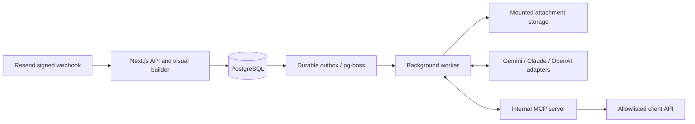

# Agent Platform

A self-hostable visual builder for email-triggered agents. Connect Gemini, Claude, or OpenAI credentials, define tools from your APIs, and configure task outcomes and follow-up actions.

**Receipt email → attachment upload → Gemini agent → MCP tool → client API**

TypeScript · Next.js · Mantine · React Flow · PostgreSQL · pg-boss · Apache-2.0

## Quickstart

Requires Node.js 22.9+ (22 LTS recommended), pnpm 10, and Docker Compose.

```sh
pnpm install
pnpm setup:local
# Save the administrator password printed by setup.
docker compose up --build -d
```

Open http://localhost:3000 and sign in as `admin@example.com` with the generated password. Open **Receipt intake**, click **Publish**, then **Test run**. The seeded workflow uses a deterministic mock provider and a persistent mock accounting API; no external credentials are needed. The inspector shows the uploaded PDF, extracted fields, MCP call, and successful API response.

`setup:local` creates a private `.env` with independent encryption and session keys. It never overwrites an existing environment. To reset the password, run `pnpm exec tsx scripts/reset-password.ts`, save its output, then restart web. This also invalidates existing sessions.

For development with hot reload:

```sh
docker compose up -d db
pnpm db:migrate
pnpm db:seed
pnpm mock-api   # terminal 1, localhost:4010
pnpm worker     # terminal 2
pnpm dev        # terminal 3, localhost:3000
```

If port 3000 is occupied, set both `PORT=3100` and `APP_URL=http://localhost:3100` in `.env`. The web and worker must share the same attachment directory. The development launcher resolves the path from the repository root; Compose mounts `/data/attachments` into both services. The UI uses Mantine defaults and system fonts.

## Build a workflow

After signing in, choose a workflow from `/workflows` or use **New workflow** to create a blank workflow or receipt example. Each editor has its own `/workflows/[id]` URL. Use **Add step** to add **Email**, **Upload**, and **Agent** nodes; connect their side handles in that order. Add MCP tool nodes and connect their purple handles to the Agent's bottom handle. Click a node to configure it. Execution starts with one Email → Upload → Agent path, followed by sequential agents, Tool actions, and optional Outcome branches. MCP tool attachments grant capabilities to their connected agent; Tool actions execute a configured tool deterministically. Cycles, parallel execution, and branch joins are not supported.

Use **Workflow settings** to rename a workflow; **Apply** changes the draft and **Save** persists it. Drafts and canvas state survive application navigation and browser Back/Forward within the session. Links leaving an edited workflow offer **Save and leave**, **Discard and leave**, or **Stay**. Reloading or closing a tab uses the browser unsaved-change warning. Drafts are saved explicitly. Publishing validates the graph, credentials, destinations, schemas, and prompts, then creates an immutable version containing the workflow and tool definitions. Editing a draft or a tool never changes an existing version. Each receiving address can belong to one published workflow. Publishing again replaces the live version. **Delete workflow** in Workflow settings removes the workflow, its published version, and its run history once no run is active. **Test run** uses the latest published version and a generated, valid receipt PDF.

Prompt variables include `{{email.from}}`, `{{email.subject}}`, `{{email.text}}`, and `{{steps.upload.count}}` (use the actual upload node ID). Substitution happens once. Email and attachment content are untrusted data; they cannot resolve credential variables or change a tool's destination.

## Outcomes and Tool actions

Choose **Add outcome** in an agent’s settings, or **Outcome** under **Add step** and select the source agent. The new block starts with Success and Failure. An existing successor moves to Success. Add custom states with names and selection criteria. Each state has one optional connection; an unconnected state ends execution. Renaming or reordering a state preserves its stable ID and connections. Removing it removes its connection in the same draft update.

An agent connected directly to an Outcome block receives an internal `finish_task({ state, reason, result })` tool. `state` must be a stable ID from that block, and `reason` and `result` must be strings. Submit exactly one completion call, alone without other calls in that response. Invalid, missing, conflicting, or mixed reports receive correction feedback within the ten-turn limit. No calls in a mixed completion/action response are dispatched. Exhaustion, provider refusals, truncation, and infrastructure failures are execution errors and never select Failure automatically.

Generated completion instructions appear read-only in agent settings with a link to the Outcome block. They update with state edits and are removed on disconnection. The editable system prompt is stored separately. Agents without Outcome blocks keep their existing text completion and optional required-success-tool behavior. Explicit reporting replaces the required-tool completion condition while keeping protections against repeated receipt writes.

Add a **Tool action**, choose an existing MCP tool, and configure **Input arguments** as a JSON object. For example:

```json
{
  "merchant": "{{steps.agent.outcome.result}}",
  "date": "2026-09-09",
  "currency": "USD",
  "total": 42.5
}
```

References may use email fields and outputs of earlier nodes on the current path. Agent outputs expose `text`, `turns`, and, when configured, `outcome.state`, `outcome.name`, `outcome.reason`, and `outcome.result`. Action outputs expose the tool result envelope (`ok`, `data`). Use actual node IDs. A whole-value reference such as `"{{steps.action.data.total}}"` preserves numbers, objects, arrays, booleans, and null. Embedded references such as `"Total: {{steps.action.data.total}}"` interpolate text once without evaluating code. Unknown, inherited, forward, and sibling-branch references are rejected. Resolved arguments must pass the published tool’s JSON Schema before dispatch.

The accepted report, selected next node, and durable cursor commit atomically before the branch runs. Every agent gets its own prompts, conversation, attached tool scope, attachment inputs, and ten-turn allowance. Earlier results enter prompts only through explicit references. The five-minute deadline covers the entire run, including retries. A reported Failure can still produce a **succeeded** execution when its selected branch completes. The inspector shows reported outcome, reason, result, selected branch, execution status, node-associated calls, and unexecuted branches.

## Provider setup

Add an encrypted credential of type **Google Gemini**, **Claude**, or **OpenAI**, then select the matching provider and credential in each agent. Enter a model ID available to your account with function calling and PDF/image input support. OpenAI uses Responses; Claude uses Messages. All three accept the configured output-token limit. Temperature is exposed and sent only for Gemini; OpenAI and Claude use model defaults to avoid unsupported parameter combinations. Capability and authentication errors identify the configuration to check without displaying upstream secrets.

Gemini retains file upload, readiness polling, and terminal cleanup. OpenAI and Claude build inline PDF/JPEG/PNG inputs from stored local files for each request. Checkpoints contain local references, not base64 attachment bytes. Continuations preserve Gemini signatures, OpenAI output/reasoning items (including encrypted reasoning), and Claude native content/signature blocks and tool-call IDs. `finish_task` is reserved and never sent through MCP or HTTP. Completion schemas use strict mode for OpenAI and Claude; runtime report and action validation applies to every provider.

Adapters follow the official [OpenAI function calling](https://developers.openai.com/api/docs/guides/function-calling), [OpenAI file inputs](https://developers.openai.com/api/docs/guides/file-inputs), [Claude tool definitions](https://platform.claude.com/docs/en/agents-and-tools/tool-use/define-tools), [Claude PDF inputs](https://platform.claude.com/docs/en/build-with-claude/pdf-support), and [Gemini function calling](https://ai.google.dev/gemini-api/docs/function-calling) contracts.

## Connect Gemini and real email

1. Add your Gemini API key under **Credentials**, with type **Google Gemini**.
2. In the Agent node choose **Google Gemini**, select that credential, and enter a model ID supported by your account. The example starts with `gemini-2.5-flash`; availability is provider/account dependent.
3. Create or edit `submit_receipt` under **MCP tools**. Set the fixed endpoint, input JSON Schema, request-field mappings, and optional bearer/API-key credential. Add the endpoint's exact origin to **Allowed tool origins** under **Settings**. Production destinations require HTTPS and public DNS addresses. Remove development private-origin exceptions before exposing the instance.
4. Configure a receiving domain in Resend, set the Email node's recipient, and subscribe a Resend webhook to `email.received` at `https://your-instance.example/api/webhooks/resend`. Enter the Resend API key and webhook secret under **Settings**. Point `APP_URL` at that exact HTTPS origin and terminate TLS at your reverse proxy.
5. Publish, then send one receipt PDF, JPEG, or PNG to the configured address. The worker retrieves email and attachment bytes from Resend, checks their type and total size, uploads selected files through Gemini's Files API, waits for readiness, and gives the agent file references.

See [Resend receiving](https://resend.com/docs/knowledge-base/how-can-i-receive-emails-with-resend), [received email retrieval](https://resend.com/docs/api-reference/emails/retrieve-received-email), [Gemini Files](https://ai.google.dev/gemini-api/docs/files), and [Gemini function calling](https://ai.google.dev/gemini-api/docs/function-calling).

The example extracts merchant, date, currency, total, and optional tax/line items. Its `requiredTool` is `submit_receipt`: the run succeeds only after a successful client API response and agent completion. The mock provider is only for synthetic fixtures; use a configured live provider for real extraction.

## Generated MCP tools

Tool definitions contain a name, description, fixed URL, method, object JSON Schema, mappings, credential reference, and optional idempotency header. Mappings select an argument path (`source`), an outbound field (`target`), and `body` or `query`. Endpoint/host/header selection is never delegated to the model. Credentials are resolved after argument validation, and secrets are redacted from returned tool results.

The worker creates an official [TypeScript MCP SDK](https://github.com/modelcontextprotocol/typescript-sdk) server, registers discovery and calling handlers, and connects an SDK client over `InMemoryTransport`. It discovers tools through MCP, converts the definitions to provider function declarations, dispatches requested calls through MCP, and returns structured tool results to the provider. There is no arbitrary user code or externally exposed MCP server in v1.

Only set an idempotency header if the destination API guarantees deduplication for it. An HTTP error, timeout, or connection failure after a possible write can be ambiguous. Such writes enter **needs review** when no idempotency guarantee exists. Inspect the client API before starting another run; the platform never automatically requeues a run needing review.

## Architecture



| Directory                      | Responsibility                                                                       |
| ------------------------------ | ------------------------------------------------------------------------------------ |
| `apps/web`                     | Authenticated App Router API, React Flow editor, credentials/tools UI, run inspector |
| `apps/worker`                  | Durable job consumer, heartbeat, outbox recovery, cleanup                            |
| `packages/contracts`           | Validated graph/tool contracts, prompt substitution, receipt example                 |
| `packages/persistence`         | Drizzle schema/migrations, PostgreSQL transactions, AES-256-GCM credentials          |
| `packages/providers`           | Provider interface, Gemini / OpenAI / Claude adapters, deterministic mock            |
| `packages/connectors`          | Resend signature verification/retrieval, bounded HTTP, storage interface             |
| `packages/mcp`                 | Official SDK internal server/client, JSON Schema validation, generated HTTP tools    |
| `packages/runtime`             | Publication, ingestion, checkpoints, tool call ledger, recovery                      |
| `scripts`, `fixtures`, `tests` | Setup/seed, mock API, synthetic receipt, unit/integration/browser/live checks        |

Signed webhooks persist the email event, original published version, run, and queue outbox in one transaction. A delivery is acknowledged only after queue dispatch; queue outages leave the outbox durable and return a retryable response. Provider email IDs deduplicate concurrent deliveries, including deliveries retried after a workflow is republished. Unmatched signed email events are recorded without starting a run.

Workers acquire a PostgreSQL advisory lock per run. Model messages (including Gemini thought signatures), pending tool calls, and upload progress are checkpointed. A durable ledger caches completed calls and supplies stable per-call idempotency keys. pg-boss retries transient failures with backoff, heartbeats detect lost workers, and resumed execution reuses checkpoints. An unconfirmed non-idempotent write is held for review. Default execution limits are ten model turns per agent, ten calls per turn, and five minutes of wall time from first execution, including retries.

Checkpoint JSON is versioned (v2) with a durable cursor, per-node state, and prior outputs. Legacy single-agent checkpoints decode into that format and retain their original tool-call identities. Migration `0002_node_attribution` adds nullable `node_id` to the call ledger; legacy records remain readable. Published snapshots are never rewritten. New call identities include run and node IDs, so identical calls in different nodes remain independent. Completed calls recover from the ledger; an unresolved write cannot be bypassed.

Provider file names are tracked for terminal cleanup and cleanup retries. Local attachments expire after seven days. **Maximum attachment bytes per email** under **Settings** defaults to 20 MiB. Run records, email text, and checkpoints remain in PostgreSQL for inspection; manage database retention and encrypted backups according to your own needs.

## Verification

```sh
pnpm lint
pnpm typecheck
pnpm test
pnpm test:integration
pnpm exec playwright install chromium
E2E_ADMIN_PASSWORD='<your local administrator password>' pnpm test:e2e
pnpm build
```

Integration tests create and drop an isolated temporary database using `TEST_DATABASE_URL` or `DATABASE_URL`; the test role needs permission to create databases. They never truncate the development database. Browser tests add uniquely named workflows and synthetic credentials to the development instance and run the mock receipt through the actual queue and worker.

The opt-in live check waits for a real Resend email and asserts that the published Gemini workflow calls `submit_receipt` successfully:

```sh
RUN_LIVE=1 LIVE_WORKFLOW_ID=receipt-example pnpm test:live
# Send a real receipt to the configured address while this command waits.
```

The separate provider outcome check executes Success, Failure, and custom Review tasks against each configured real provider. Each run uses a synthetic PDF and a controlled local action endpoint; it verifies exactly the selected action was dispatched. It leaves labeled synthetic workflow/run records for inspection.

```sh
RUN_LIVE_OUTCOMES=1 \
LIVE_GEMINI_CREDENTIAL_ID=... LIVE_GEMINI_MODEL=... \
LIVE_CLAUDE_CREDENTIAL_ID=... LIVE_CLAUDE_MODEL=... \
LIVE_OPENAI_CREDENTIAL_ID=... LIVE_OPENAI_MODEL=... \
pnpm test:live:outcomes
```

Missing provider configuration is reported as skipped and exits nonzero when opted in. Without the opt-in flag, the command makes no live calls. Report these results separately from fixture tests. The original real inbound receipt check remains required for verifying Resend integration.

Live checks require your own credentials, receiving domain, public webhook, and reachable client API. They incur the provider's normal charges. CI runs local mocks; it does not require external API secrets.

## Operating the instance

Keep PostgreSQL, the encryption key, and attachment storage together in backups. Losing the encryption key makes stored credentials unrecoverable. Changing the session secret invalidates sessions. Store a new credential and republish workflows to rotate a provider or API credential; old versions retain their original credential reference.

Use HTTPS, a trusted reverse proxy, and restricted origin allowlists. The application uses a 12-hour signed HttpOnly session, SameSite cookies, origin checks on authenticated writes, and a database-backed login attempt limit. Tool requests reject redirects and pin DNS resolution to prevent destination changes between validation and connection. Private origins are explicit administrator exceptions intended for the included mock service.

Docker Compose is a single-host reference deployment. Review backup/restore, TLS, database access, and capacity for your environment. The example database password and private mock exceptions are development settings.

`docker-compose.prod.yml` runs the same stack without the mock API behind Caddy, which obtains TLS certificates for `agent.ofintech.net`. The server keeps its own `.env` in `~/agent-platform`. The CI `deploy` job syncs every verified push to `main` there over SSH using the `DEPLOY_SSH_KEY` repository secret and rebuilds the containers.

## Scope and license

One administrator, one workspace, bring-your-own Gemini, Claude, or OpenAI credentials. Cycles, parallel branches, branch joins, multi-tenant SaaS, billing, model hosting, inbox OAuth, OpenAPI import, and external MCP hosting are outside this release.

Licensed under [Apache-2.0](LICENSE). Contributions welcome; see [CONTRIBUTING.md](CONTRIBUTING.md) and [SECURITY.md](SECURITY.md).

## Terminal email replies

Add **Send email** after an agent, Tool action, or individual Outcome state. It has one input and no output. The sender is the trigger inbox saved in the published version; the recipient is the original email's `from` mailbox, including display-name formats. There are no recipient overrides, CC/BCC, Reply-To routing, HTML, or outbound attachments.

Enter a required plain-text body template and optionally a subject template. The variable helper inserts references into the last focused template, including earlier agent text, agent Outcome fields, action data, and email fields. Publication checks branch ancestry. Empty subjects use the original subject with `Re:` added only when absent. Resolved bodies must contain text; invalid addresses and header values fail before dispatch. Existing attachment requirements and agent completion behavior still apply.

Editor **Test run** renders **Preview only** without sending or needing a Resend API key. Real inbound runs send automatically through Resend when they reach this step. Configure a Resend API key with sending permissions under **Settings** and verify the trigger inbox domain for outbound sending as well as inbound receiving. Original `message_id` metadata becomes `In-Reply-To` and `References`; legacy emails without it still receive a subject-based reply. See [Resend reply threading](https://resend.com/docs/dashboard/receiving/reply-to-emails).

The additive `email_sends` ledger freezes the resolved message before dispatch. Run/node identities produce deterministic idempotency keys. Acceptance, step output, and checkpoint cursor commit together; checkpoint version 2 and older decoding remain supported. Retries reuse the frozen message, and stop at least one minute before [Resend's 24-hour idempotency window](https://resend.com/docs/dashboard/emails/idempotency-keys) expires. Uncertain writes at the execution deadline or after a nonretryable failure require review. Check Resend before starting another run for the same email. **Accepted by Resend** means provider acceptance, not confirmed inbox delivery; a completed Failure branch is technically successful.

The inspector displays the resolved sender, recipient, subject/body, delivery mode, acceptance ID, and errors. Unselected branches remain **Not executed**.

For opt-in live verification, publish a controlled workflow with at least two Outcome branches ending in distinct email steps, configure a real provider, and use a controlled sender inbox and a verified Resend sending domain:

```sh
RUN_LIVE_EMAIL=1 LIVE_EMAIL_WORKFLOW_ID=... LIVE_EMAIL_SENDER=you@your-controlled-domain.example pnpm test:live:email
# Send a receipt attachment from that controlled inbox to the published trigger.
```

This observer verifies a real inbound run, reply headers, Resend acceptance, and that only the selected branch sent. Repeat with tasks selecting each branch. Confirm delivery and threading in the controlled inbox separately. Missing configuration is reported as skipped with nonzero exit when opted in; without the flag there are no live calls. The existing real inbound receipt and live-provider Outcome checks remain required; fixture passes do not count as live verification.
